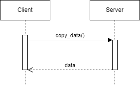

This microservice uses ZeroMQ to communicate between server and client.

Install pyzmq dependency by entering "pip install pyzmq"

# client.py - Request Data
Enter the data in the data dictionary. "readyForCopying" is a boolean. For example
data = {
    "readyForCopying": True,
    "json_data": {
        "name": "pizza",
        "description": "delicious",
        "category": "food",
        "price": "20"
    }
}
Then call the function copy_data. For example
copy_data(data)

# server.py - Receive Data
Nothing to do here. Receives JSON data and converts to dictionary. If "readyForCopying" is True, it deletes the "category" key
and changes "readyForCopying" to False. Finally, it sends the data back.

# UML

